# ERPNext Architecture Overview

This document provides a comprehensive high-level overview of the ERPNext system architecture, showing the principal components and their interconnections through cognitive flow patterns.

## System Architecture Overview

The following diagram illustrates the top-level architecture of ERPNext, highlighting the major modules and their hierarchical relationships within the cognitive system framework.

```mermaid
graph TD
    %% Core Framework Layer
    subgraph "Frappe Framework Core"
        FF[Frappe Framework]
        DB[(Database Layer)]
        API[REST API Gateway]
        AUTH[Authentication System]
        WEB[Web Interface]
    end

    %% Business Logic Modules - Central Hub
    subgraph "Core Business Modules"
        ACCOUNTS[Accounts Module]
        SELLING[Selling Module] 
        BUYING[Buying Module]
        STOCK[Stock Management]
        MFG[Manufacturing Module]
        PROJECTS[Projects Module]
    end

    %% Customer Relationship Management
    subgraph "Customer Experience Layer"
        CRM[Customer Relationship Management]
        PORTAL[Customer Portal]
        SUPPORT[Support System]
        COMM[Communication Hub]
    end

    %% Operations and Assets
    subgraph "Operations Management"
        ASSETS[Asset Management]
        MAINTENANCE[Maintenance Operations]
        QUALITY[Quality Management]
        UTILITIES[System Utilities]
    end

    %% Integration and External Systems
    subgraph "Integration Layer"
        EDI[Electronic Data Interchange]
        INTEGRATIONS[ERPNext Integrations]
        REGIONAL[Regional Compliance]
        TELEPHONY[Telephony Integration]
    end

    %% Advanced Operations
    subgraph "Advanced Features"
        SUBCONTRACT[Subcontracting]
        BULK[Bulk Transactions]
        SETUP[System Setup]
    end

    %% Data Flow Connections - Cognitive Pathways
    FF --> ACCOUNTS
    FF --> SELLING
    FF --> BUYING
    FF --> STOCK
    FF --> MFG
    FF --> PROJECTS

    %% Inter-module Synergies
    SELLING --> ACCOUNTS
    SELLING --> STOCK
    SELLING --> PROJECTS
    BUYING --> ACCOUNTS
    BUYING --> STOCK
    BUYING --> MFG
    MFG --> STOCK
    MFG --> BUYING
    PROJECTS --> ACCOUNTS
    PROJECTS --> STOCK

    %% Customer Experience Integration
    CRM --> SELLING
    CRM --> PROJECTS
    PORTAL --> SELLING
    PORTAL --> ACCOUNTS
    SUPPORT --> CRM
    COMM --> CRM
    COMM --> SUPPORT

    %% Operations Integration
    ASSETS --> ACCOUNTS
    ASSETS --> MAINTENANCE
    MAINTENANCE --> PROJECTS
    QUALITY --> MFG
    QUALITY --> STOCK

    %% External Integration Pathways
    EDI --> BUYING
    EDI --> SELLING
    INTEGRATIONS --> ACCOUNTS
    REGIONAL --> ACCOUNTS
    TELEPHONY --> CRM

    %% Advanced Feature Integration
    SUBCONTRACT --> BUYING
    SUBCONTRACT --> MFG
    BULK --> ACCOUNTS
    SETUP --> FF

    %% Core Infrastructure Dependencies
    DB --> FF
    API --> FF
    AUTH --> FF
    WEB --> FF

    %% Styling for Cognitive Clarity
    classDef coreFramework fill:#e1f5fe,stroke:#01579b,stroke-width:3px
    classDef businessCore fill:#f3e5f5,stroke:#4a148c,stroke-width:3px
    classDef customerLayer fill:#e8f5e8,stroke:#1b5e20,stroke-width:2px
    classDef operations fill:#fff3e0,stroke:#e65100,stroke-width:2px
    classDef integration fill:#fce4ec,stroke:#880e4f,stroke-width:2px
    classDef advanced fill:#f1f8e9,stroke:#33691e,stroke-width:2px

    class FF,DB,API,AUTH,WEB coreFramework
    class ACCOUNTS,SELLING,BUYING,STOCK,MFG,PROJECTS businessCore
    class CRM,PORTAL,SUPPORT,COMM customerLayer
    class ASSETS,MAINTENANCE,QUALITY,UTILITIES operations
    class EDI,INTEGRATIONS,REGIONAL,TELEPHONY integration
    class SUBCONTRACT,BULK,SETUP advanced
```

## Architectural Principles

### 1. Hierarchical Cognitive Architecture

The ERPNext system follows a hierarchical cognitive architecture where:

- **Frappe Framework Core** provides the foundational neural-symbolic integration layer
- **Business Modules** form the primary cognitive kernels for domain-specific processing
- **Supporting Layers** provide specialized cognitive functions and external integrations

### 2. Adaptive Attention Allocation

The system employs adaptive attention allocation mechanisms through:

- **Event-driven Processing** - Modules respond to document lifecycle events
- **Workflow Automation** - Intelligent routing of business processes
- **Permission Systems** - Context-aware access control and data security

### 3. Recursive Implementation Pathways

Each module contains recursive implementation patterns:

- **DocType Architecture** - Self-referential document structures
- **Controller Inheritance** - Hierarchical behavior patterns
- **Hook Systems** - Recursive event propagation mechanisms

## Core Module Responsibilities

### Business Logic Core

- **Accounts**: Financial transaction processing, ledger management, tax calculations
- **Selling**: Sales process management, customer interactions, order fulfillment
- **Buying**: Procurement workflows, vendor management, purchase operations  
- **Stock**: Inventory tracking, warehouse management, item lifecycle
- **Manufacturing**: Production planning, BOM management, work order execution
- **Projects**: Task management, resource allocation, timeline tracking

### Customer Experience Layer

- **CRM**: Lead management, opportunity tracking, customer relationship data
- **Portal**: Self-service customer interface, document access, communication
- **Support**: Issue tracking, service level agreements, resolution workflows
- **Communication**: Email integration, notification systems, message routing

### Operations Management

- **Assets**: Fixed asset tracking, depreciation, maintenance scheduling
- **Maintenance**: Preventive maintenance, repair workflows, service visits
- **Quality**: Quality control processes, inspection workflows, compliance tracking
- **Utilities**: System tools, bulk operations, data management functions

## Emergent Cognitive Patterns

The architecture demonstrates several emergent cognitive patterns:

1. **Self-Organizing Workflows** - Business processes automatically adapt based on configuration
2. **Context-Aware Processing** - Modules adjust behavior based on system state and user context
3. **Distributed Decision Making** - Intelligence distributed across modules with coordinated outcomes
4. **Learning and Adaptation** - System behavior improves through usage patterns and feedback loops

## Technical Foundation

The cognitive architecture is built upon:

- **Python Backend** - Core business logic and data processing
- **JavaScript Frontend** - Dynamic user interface and real-time interactions
- **Database Abstraction** - Flexible data storage with relationship mapping
- **REST API Architecture** - Stateless communication and integration capabilities
- **Event System** - Asynchronous processing and module coordination

This architecture enables ERPNext to function as a comprehensive cognitive system for enterprise resource planning, with emergent intelligence arising from the interactions between its specialized modules.