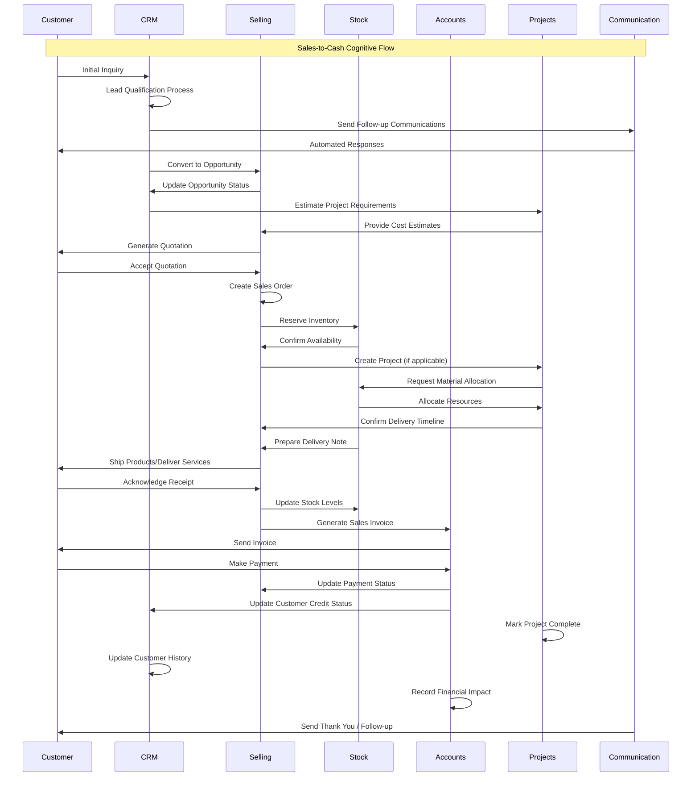
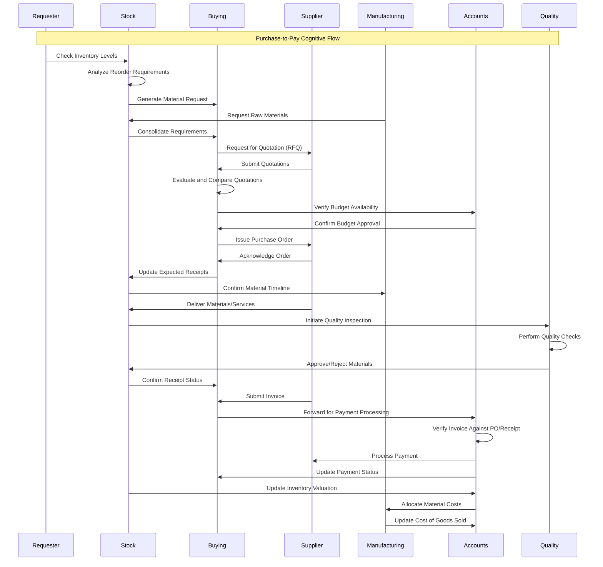
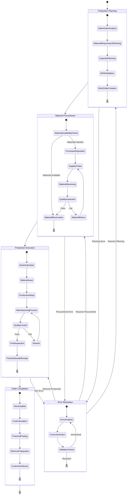
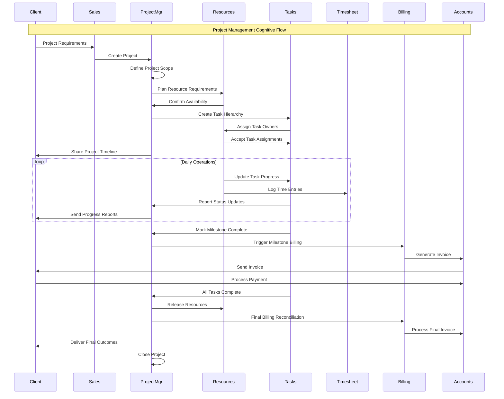
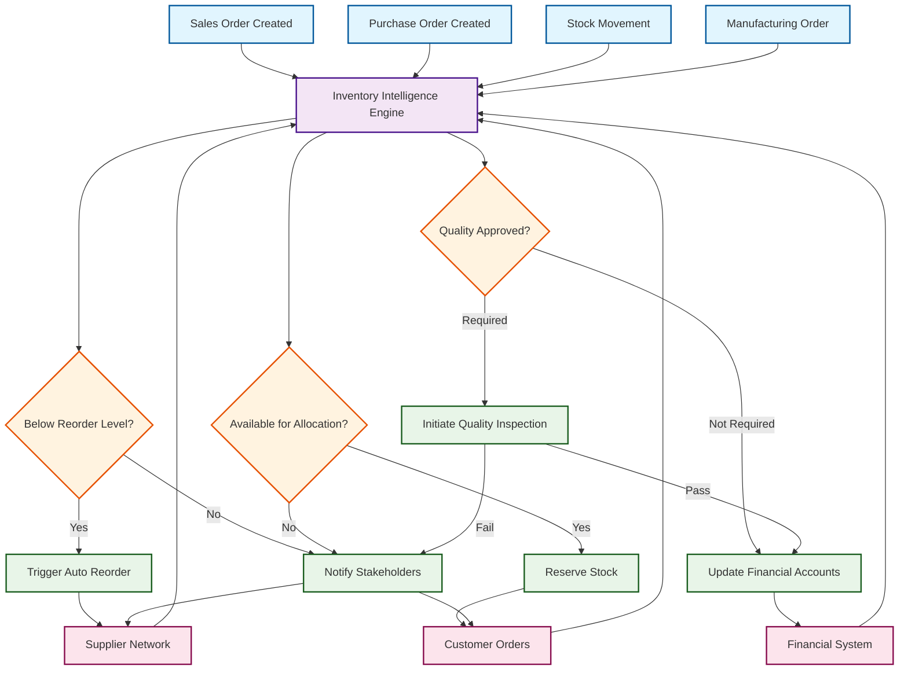
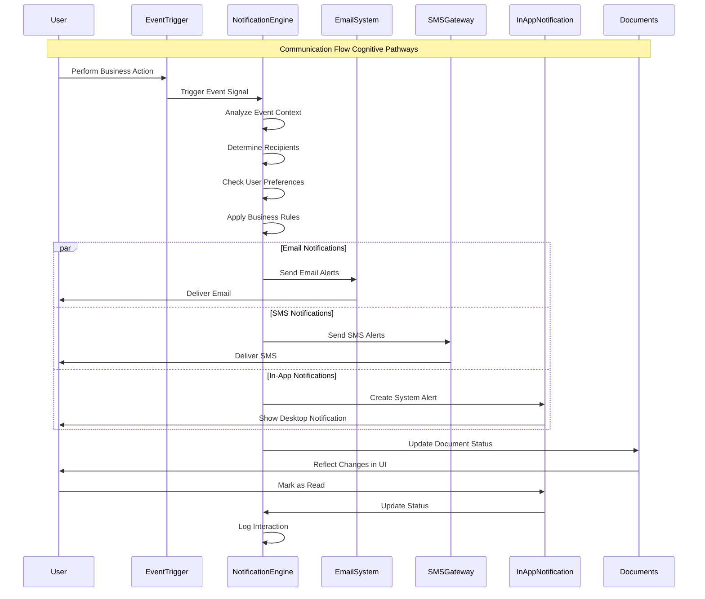

# ERPNext Data Flows and Process Pathways

This document illustrates the key business process flows and data propagation pathways within ERPNext, showing how information moves through the cognitive system during critical business operations.

## Sales-to-Cash Process Flow

The following sequence diagram shows the complete sales-to-cash cognitive pathway, from initial customer interaction through final payment collection.

## Purchase-to-Pay Process Flow

This sequence diagram illustrates the purchase-to-pay cognitive pathway, showing how procurement needs flow through the system to final vendor payment.

## Manufacturing Process Flow

This state diagram shows the manufacturing workflow states and transitions, illustrating how production orders flow through the cognitive manufacturing system.

## Project Management Workflow

This diagram shows how project-based work flows through the cognitive project management system.

## Inventory Management Signal Flow

This diagram illustrates how inventory signals propagate through the cognitive inventory management system.

## Communication and Notification Flows

This sequence shows how the communication system orchestrates notifications and information flow across the cognitive architecture.

## Cognitive Patterns in Data Flow

### 1. Adaptive Signal Routing

The system demonstrates adaptive signal routing through:

- **Context-Aware Routing**: Signals routed based on business context and urgency
- **Load Balancing**: System distributes processing loads across available resources
- **Intelligent Queuing**: Critical processes receive priority in the execution queue

### 2. Emergent Process Optimization

The workflows exhibit emergent optimization through:

- **Pattern Learning**: System learns optimal pathways from historical executions
- **Exception Prediction**: Proactive identification of potential process bottlenecks
- **Dynamic Adjustment**: Real-time modification of workflows based on current conditions

### 3. Neural-Symbolic Integration

The data flows demonstrate neural-symbolic integration through:

- **Rule-Based Processing**: Explicit business rules guide information flow
- **Pattern Recognition**: System recognizes and responds to recurring data patterns
- **Knowledge Representation**: Business knowledge encoded in flow logic and decision points

These process flows showcase how ERPNext functions as a comprehensive cognitive system, with intelligent information routing, adaptive decision-making, and emergent optimization capabilities that enable efficient enterprise operations.