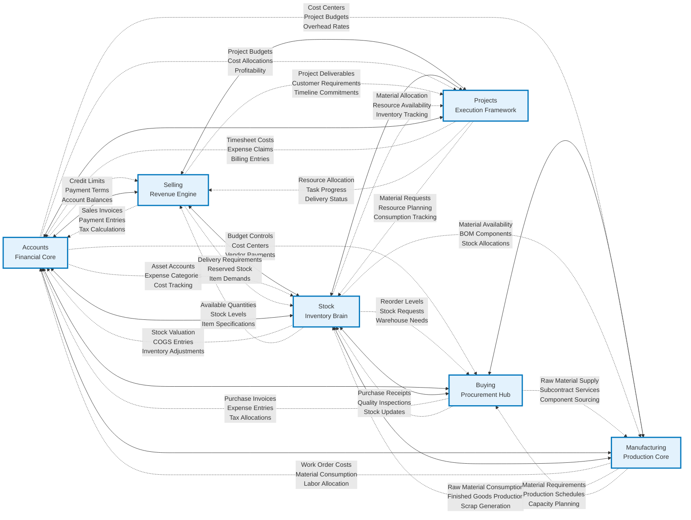
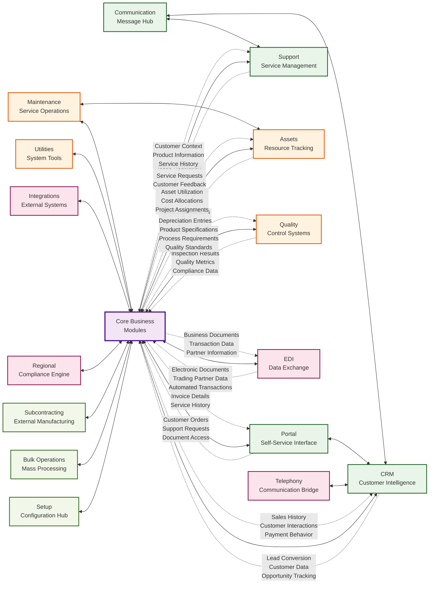

# ERPNext Module Interactions

This document maps the detailed inter-module relationships and bidirectional synergies within the ERPNext ecosystem, following hypergraph pattern encoding principles.

## Core Business Module Interactions

The following diagram illustrates the bidirectional synergies between core business modules, showing how information and control flow between different cognitive subsystems.

## Extended Ecosystem Interactions

This diagram shows how supporting modules integrate with the core business logic through specialized cognitive interfaces.

## Cognitive Synergy Patterns

### 1. Recursive Information Processing

The module interactions demonstrate recursive information processing patterns:

- **Feedback Loops**: Each transaction creates feedback that influences future processing
- **State Propagation**: Changes in one module automatically propagate to dependent modules
- **Context Awareness**: Modules adjust behavior based on information from related modules

### 2. Emergent Intelligence Networks

The bidirectional relationships create emergent intelligence through:

- **Cross-Module Validation**: Business rules span multiple modules for consistency
- **Intelligent Defaults**: System learns optimal configurations from usage patterns
- **Predictive Analytics**: Historical data across modules enables forecasting

### 3. Adaptive Attention Mechanisms

The system demonstrates adaptive attention allocation through:

- **Priority Routing**: Critical transactions receive immediate cross-module attention
- **Resource Optimization**: System balances processing loads across modules
- **Exception Handling**: Anomalies trigger coordinated responses across relevant modules

## Key Integration Points

### Financial Integration Hub

The Accounts module serves as the central financial integration hub:

- **Transaction Recording**: All financial events flow through the accounts system
- **Reporting Consolidation**: Financial reports aggregate data from all modules
- **Compliance Management**: Tax and regulatory requirements coordinate across modules

### Inventory Intelligence Network

The Stock module functions as the inventory intelligence network:

- **Real-time Availability**: Provides instant stock status to all requesting modules
- **Demand Prediction**: Analyzes consumption patterns across sales, manufacturing, and projects
- **Supply Chain Coordination**: Coordinates with buying and manufacturing for optimal inventory

### Customer Experience Orchestration

The CRM and Portal modules orchestrate customer experience:

- **360-Degree View**: Integrates all customer touchpoints and interactions
- **Service Continuity**: Maintains context across sales, support, and project interactions
- **Communication Coordination**: Ensures consistent messaging across all channels

## Neural-Symbolic Integration Points

The module interactions exhibit neural-symbolic integration through:

1. **Symbolic Rule Processing**: Business rules encoded as explicit logic across modules
2. **Pattern Recognition**: System recognizes patterns in cross-module transaction flows
3. **Learning Mechanisms**: System improves performance through usage pattern analysis
4. **Knowledge Representation**: Business knowledge encoded in module relationships

## Performance Optimization Strategies

The cognitive architecture optimizes performance through:

- **Lazy Loading**: Modules load data only when needed for specific interactions
- **Caching Strategies**: Frequently accessed cross-module data is cached intelligently
- **Asynchronous Processing**: Non-critical cross-module updates happen asynchronously
- **Load Balancing**: System distributes processing across modules based on capacity

This modular interaction design enables ERPNext to function as a cohesive cognitive system while maintaining the flexibility and scalability required for enterprise applications.