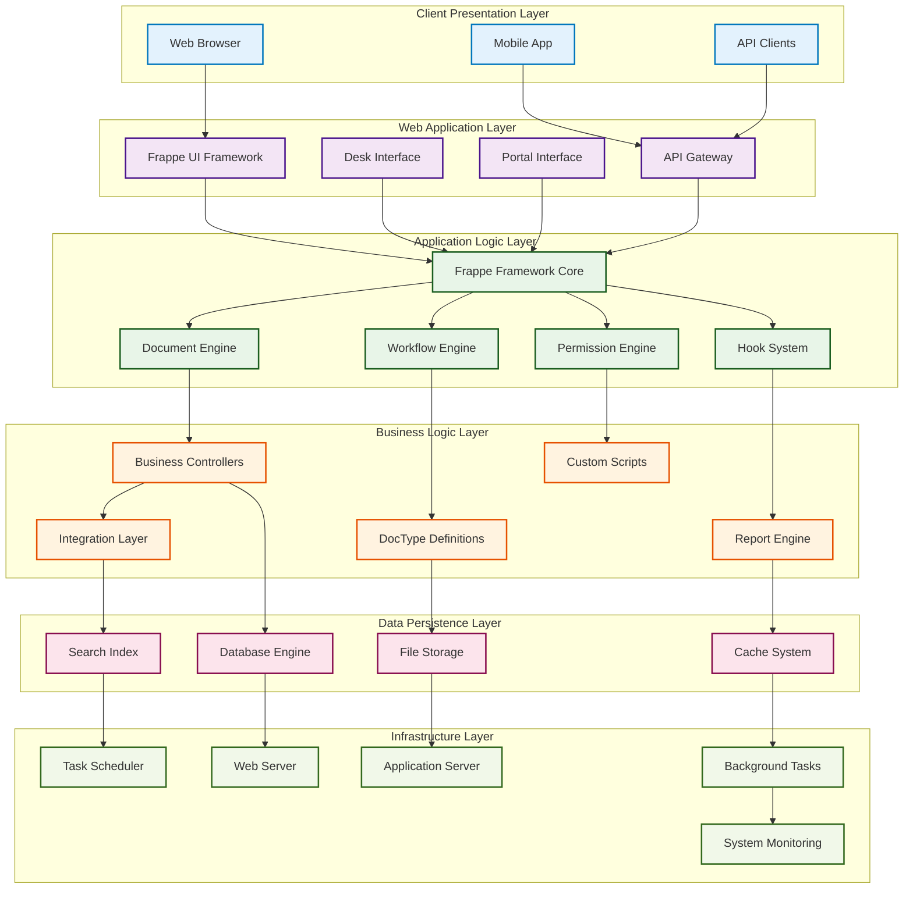
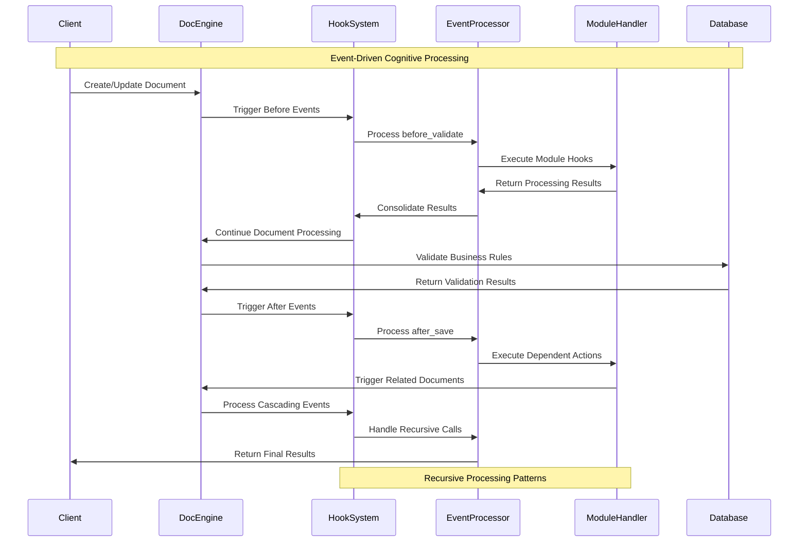
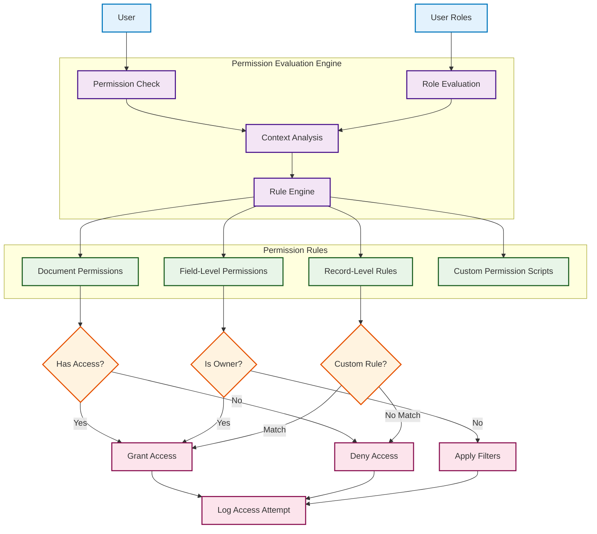
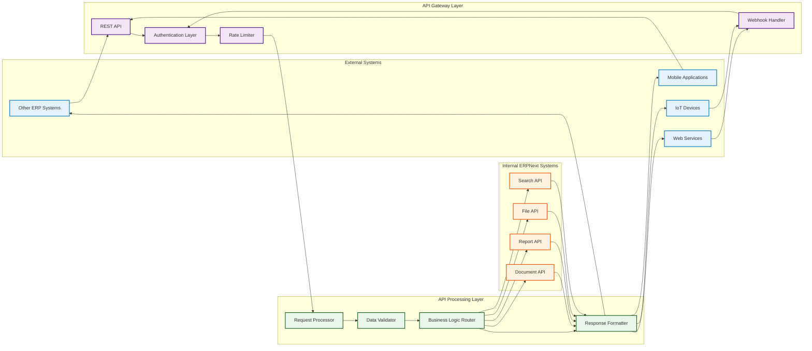
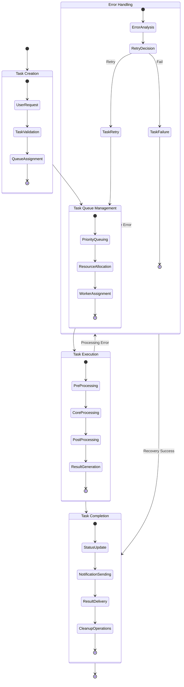

# ERPNext Technical Architecture

This document provides a comprehensive view of the technical architecture and framework components that enable ERPNext's cognitive capabilities, including recursive implementation pathways and neural-symbolic integration points.

## Framework Architecture Overview

The following diagram illustrates the technical architecture layers and their cognitive processing capabilities.



## DocType Architecture - Cognitive Document System

ERPNext's core cognitive architecture is built around the DocType system, which provides neural-symbolic integration for business documents.

```mermaid
classDiagram
    class DocType {
        +String name
        +String module
        +Boolean is_submittable
        +Boolean is_child_table
        +List~DocField~ fields
        +List~DocPerm~ permissions
        +validate()
        +before_save()
        +after_insert()
        +on_submit()
        +on_cancel()
    }

    class DocField {
        +String fieldname
        +String fieldtype
        +String label
        +Boolean mandatory
        +String options
        +String default_value
        +validate_field()
        +get_value()
        +set_value()
    }

    class Document {
        +String name
        +String doctype
        +Dict meta
        +Dict flags
        +load()
        +save()
        +submit()
        +cancel()
        +delete()
        +get_doc()
        +run_method()
    }

    class Controller {
        +Document doc
        +validate()
        +before_save()
        +after_insert()
        +on_submit()
        +on_cancel()
        +before_delete()
        +on_trash()
    }

    class BuyingController {
        +validate_items()
        +validate_warehouse()
        +set_supplier_address()
        +validate_budget()
        +update_valuation_rate()
    }

    class SellingController {
        +validate_items()
        +validate_delivery_date()
        +set_customer_address()
        +calculate_taxes()
        +update_customer_credit()
    }

    class StockController {
        +validate_warehouse()
        +update_stock_ledger()
        +make_gl_entries()
        +update_serial_batch()
    }

    class AccountsController {
        +make_gl_entries()
        +validate_account()
        +calculate_taxes()
        +update_outstanding()
    }

    DocType ||--o{ DocField
    DocType ||--|| Controller
    Document ||--|| DocType
    Controller <|-- BuyingController
    Controller <|-- SellingController
    Controller <|-- StockController
    Controller <|-- AccountsController

    %% Styling
    classDef coreClass fill:#e3f2fd,stroke:#0277bd,stroke-width:2px
    classDef controllerClass fill:#f3e5f5,stroke:#4a148c,stroke-width:2px

    class DocType,DocField,Document,Controller coreClass
    class BuyingController,SellingController,StockController,AccountsController controllerClass
```

## Event-Driven Architecture - Hook System

The cognitive system operates through an sophisticated event-driven architecture that enables recursive processing patterns.



## Permission System - Cognitive Access Control

The permission system implements context-aware access control with adaptive attention allocation mechanisms.



## API Architecture - External Integration Pathways

The API architecture provides cognitive interfaces for external system integration and adaptive communication protocols.



## Background Processing - Asynchronous Cognitive Tasks

The system employs sophisticated background processing for complex cognitive tasks and long-running operations.



## Cognitive Architecture Patterns

### 1. Recursive Implementation Pathways

The technical architecture demonstrates recursive patterns through:

- **Self-Referential DocTypes**: Documents that reference themselves for hierarchical structures
- **Recursive Hook Processing**: Events that trigger cascading events in related documents
- **Nested Permission Evaluation**: Permissions that depend on other permission evaluations

### 2. Neural-Symbolic Integration Points

The system exhibits neural-symbolic integration through:

- **Rule-Based Processing**: Explicit business rules encoded in Python/JavaScript
- **Pattern Recognition**: System learns from usage patterns and optimizes performance
- **Knowledge Representation**: Business domain knowledge embedded in framework structures

### 3. Adaptive Attention Allocation

The architecture implements adaptive attention through:

- **Dynamic Resource Allocation**: System distributes processing power based on current load
- **Priority-Based Queuing**: Critical operations receive immediate attention
- **Context-Aware Processing**: System behavior adapts based on current business context

## Performance Optimization Strategies

### Caching Mechanisms

- **Document Caching**: Frequently accessed documents cached in memory
- **Permission Caching**: User permissions cached to avoid repeated calculations
- **Query Result Caching**: Database query results cached for repeated access

### Asynchronous Processing

- **Background Tasks**: Long-running operations moved to background queues
- **Event Debouncing**: Multiple rapid events consolidated into single operations
- **Lazy Loading**: Data loaded only when specifically requested

### Database Optimization

- **Index Optimization**: Strategic database indexes for query performance
- **Connection Pooling**: Efficient database connection management
- **Query Optimization**: Intelligent query generation and optimization

This technical architecture enables ERPNext to function as a sophisticated cognitive system, with emergent intelligence arising from the interaction of its technical components and the business logic implemented within the framework.